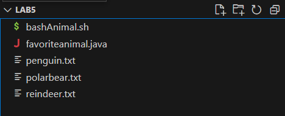

## Part 1 – Debugging Scenario

In Part 1 of this lab report, a hypothetical student encounters a bug in their program and submits a post on edStem detailing the problem. Their post is as follows:

_Note: This is based on a real bug I ran into during a lab however the project is made up. Chat GPT and online resources were used to write portions of the hypothetical programming project. (The Chat GPT section is included at the end of this lab report)_

### Original Student Post

Hi, I have encountered a bug in my program. My program consists of a bash script which gives the first argument as an input to a java program.

The project layout consists of the following files: 



_penguin.txt_, _polarbear.txt_, and _reindeer.txt_ are .txt files containing information about each animal from Wikipedia. The program is run from the command line by running the bash script when the current directory is the program folder. The program also requires the .java file which it compiles.

The Java program I have written is as follows: 


And the Bash script I have written is as follows:


**What environment are you using (computer, operating system, web browser, terminal/editor, and so on)?**

I am using Windows 10 and VSCode for my program. 


**Detail the symptom you're seeing. Be specific; include both what you're seeing and what you expected to see instead. Screenshots are great, copy-pasted terminal output is also great. Avoid saying “it doesn't work”.**

The symptom I am seeing is that when I run the bash script I get the following error code:


As I have both Java and Java JDK installed on my computer, I do not understand why I am getting this error which tells me that 'javac' and 'java' are not recognized.

**Detail the failure-inducing input and context. That might mean any or all of the command you're running, a test case, command-line arguments, working directory, even the last few commands you ran. Do your best to provide as much context as you can.**

The failure inducing input is running the program with one of the three recognized input strings as arguments.

### TA Response

Hi, I'm not sure exactly what the bug is yet but I was wondering if you are on Windows why are you running it with 'bash' in front? Usually you would use git-bash or run the program in a Linux VM as Windows does not natively have Bash commands.

### Student Response

Hi, I have installed Windows Subsystem for Linux which you can use to run Bash commands in a Linux VM integrated into Windows. Your response made me realize the source of the bug: although I have Java and the Java JDK installed on Windows I did not have it installed in the Linux subsystem I was running the commands in. To fix the bugs I had to run the following commands in my Linux VM:


After installing Java and the Java JDK the program worked as expected as you can see in the output below! Thank you very much for your help and I hope you have a good rest of your day!


### Final TA Response

Thank you! I am glad your error is resolved and I hope you have a good rest of your day!

## Part 2 – Reflection

My favorite thing that I learned in the second half of the labs of this quarter was SSH Keys. Logging in is always a time consuming and repetitive task and the ability to reduce that time using SSH keys was extremely helpful both in labs and in personal projects. Although I gained a large amount of knowledge while taking this course, using SSH keys may in the short term be my most frequently used application of the course material as logging into Github is itself such a common and frequent occurence.

## Use of Chat GPT

I used Chat GPT to generate a Java file that prints out the contents of a text file. The prompt I used was "write a java file to print out the contents of a text file" and my result was: 

```
Here is an example Java program that reads the contents of a text file:

import java.io.BufferedReader;
import java.io.FileReader;
import java.io.IOException;

public class Main {
    public static void main(String[] args) {
        String fileName = "path/to/file.txt";

        try (BufferedReader br = new BufferedReader(new FileReader(fileName))) {
            String line;
            while ((line = br.readLine()) != null) {
                System.out.println(line);
            }
        } catch (IOException e) {
            e.printStackTrace();
        }
    }
}
```

I then lightly modified this file to become the Java program used in the project by changing the `String fileName = "path/to/file.txt";` line and renaming the class.

The Bash script was also generated using Chat GPT, however it was modified much more significantly. The prompt I used was "write a bash script that prints an error if the first argument is not equal to penguin or reindeer". My result was as follows:

```
#!/bin/bash

if [ "$1" != "penguin" ] && [ "$1" != "reindeer" ]; then
    echo "Error: First argument must be 'penguin' or 'reindeer'"
    exit 1
fi
```

I then modified it by adding a third possible parameter, adding the java compilation and execution step, and adding an initial argument check.
